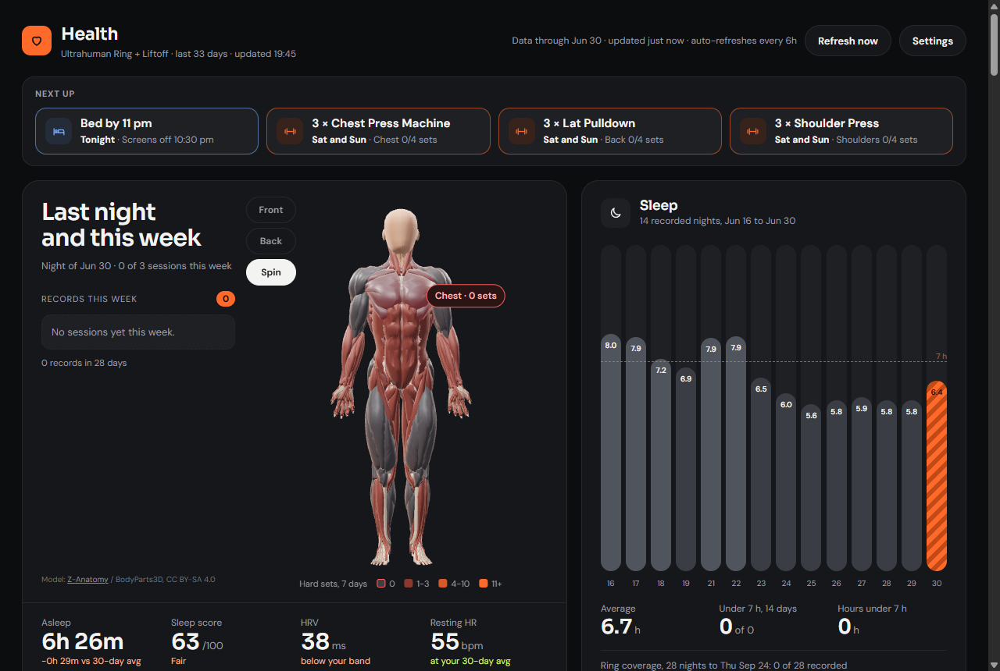

# Gains of Thrones


A private dashboard for sleep, recovery and strength training. It combines an
Ultrahuman Ring with a workout log from Liftoff or Hevy, runs entirely in your
own Cloudflare account, and refreshes itself every 6 hours.



What it shows:

- Last night: sleep time, score, stages, HRV and resting heart rate against your own 30-day range.
- Sleep over the last two weeks, bedtime consistency and ring coverage (nights the ring was charging).
- Training: hard sets per muscle group on a 3D body model, strength trends per lift (estimated 1RM), records, volume and effort read from rep drop-off.
- Correlations between sleep and training, with the statistics shown, so a pattern from a few nights is not over-read.
- A plan bar with a bedtime target and the week's lifting gaps, an optional 07:00 push notification and bedtime nudge, and a short weekly note written by Workers AI from the computed numbers.

It is a personal project. The numbers come from consumer devices and the analysis is descriptive. It is not medical advice.

## What you need

- **An Ultrahuman Ring and an Ultrahuman API token.** Generate a personal token in the Ultrahuman developer portal at [vision.ultrahuman.com](https://vision.ultrahuman.com/developer-docs). If your account does not offer one, Ultrahuman describes how to request access in [Accessing the Ultrahuman Partnership API](https://www.ultrahuman.com/blog/accessing-the-ultrahuman-partnership-api/).
- **Optional: a workout log.**
  - **Liftoff:** your Liftoff email (or username) and password. They are used once to sign in, and only the sign-in token is stored. Liftoff has no public API; this uses the same calls as the app, as the open-source [liftoff-export-cli](https://github.com/quantcli/liftoff-export-cli) does, and can break when Liftoff changes them.
  - **Hevy:** a Hevy Pro subscription and an API key from [hevy.com/settings?developer](https://hevy.com/settings?developer).
- **A Cloudflare account on the Workers Paid plan** ($5 USD/month). One refresh takes a few seconds of CPU time, and the Free plan allows 10 ms per run, so it will not work on Free. A domain is not required.

## Set it up

[](https://deploy.workers.cloudflare.com/?url=https://github.com/vinistoisr/gains-of-thrones)

1. Click **Deploy to Cloudflare**. Sign in to Cloudflare and connect GitHub when asked. Cloudflare copies this repository into your GitHub account, creates the storage bucket, and deploys the Worker.
2. When it asks for **APP_PASSWORD**, choose a long password. It protects all of your data.
3. Open the Worker's address. It looks like `https://gains-of-thrones.<your-subdomain>.workers.dev` and is shown at the end of the deploy.
4. Sign in with the password. The settings page opens.
5. Add yourself: a name, your Ultrahuman token and, if you want, Liftoff or Hevy. Each token is checked with its service when you save, so a typo shows up right away.
6. The first refresh starts on its own. When it finishes, open the dashboard.

After that it refreshes at 00:20, 06:20, 12:20 and 18:20 in the time zone set on the settings page. The **Refresh now** button runs one immediately.

Updates: the Deploy button makes your copy a separate repository. To pull in later changes, sync your copy with this one on GitHub (Sync fork, or a pull request from upstream). Cloudflare redeploys it on each push.

### Notifications

On the dashboard, find the Notifications line and press Turn on. On iPhone and iPad, add the page to your Home Screen first (Share, then Add to Home Screen) and turn them on from there. The Worker sends at most 4 pushes per person in any 7 days: a 07:00 note on days a rule fires, and a bedtime nudge when your bedtimes slip.

### More than one person

The settings page holds up to eight people, each with their own tokens. Everyone signs in with the same password and can switch between people on the dashboard.

## Your data

- Everything is stored in an R2 bucket in your own Cloudflare account: raw daily ring data, workouts, the rendered page, and the tokens you enter on the settings page. Nothing is sent anywhere else except requests to Ultrahuman, Liftoff or Hevy for your own data, and to Workers AI (also in your account) for the weekly note.
- Tokens are stored in the bucket and never sent back to the browser. The settings page only shows whether each one is connected.
- Your Liftoff password is not stored.
- Hevy logs weights in kg. They are converted to pounds, because the whole page is in pounds. RPE becomes reps in reserve (10 minus RPE).
- Removing a person deletes their tokens. Their stored data stays in the bucket until you delete it in the Cloudflare dashboard (R2, `gains-of-thrones`, `data/<id>/`).

## Optional

### Your own domain

In the Cloudflare dashboard open Workers & Pages, this Worker, Settings, Domains & Routes, and add a custom domain. The password sign-in works the same on any address.

### Cloudflare Access instead of the password

If you already use Cloudflare Zero Trust, you can put the Worker behind an Access application and let the Worker check the Access token itself. Set these variables on the Worker:

| Variable | Value |
| --- | --- |
| `ACCESS_TEAM` | `https://<team>.cloudflareaccess.com` |
| `ACCESS_AUD` | the Access application's AUD tag |
| `EMAIL_USERS` | JSON mapping login emails to person ids, e.g. `{"me@example.com":"sam"}` |
| `ADMIN_CLIENT_ID` | optional: an Access service token that may do everything, not only read |

With both `ACCESS_TEAM` and `ACCESS_AUD` set, the password sign-in is turned off.

### Coach snapshot for an AI assistant

Each refresh also writes a compact Markdown summary per person (recent nights, sessions set by set, muscle-group volume, strength trends, the week's plan). Set a secret named `API_TOKEN` and fetch it with:

```sh
curl -H "Authorization: Bearer $API_TOKEN" "https://<your-worker>/coach?user=<person-id>"
```

The token can read `/coach` and `/status` and nothing else.

### Computer screen time

If a file `data/<person-id>/screentime.json` exists in the bucket, a screen-time chart and two evening-screen correlations appear. The format is `{"YYYY-MM-DD": {"pc": <active minutes>, "pcEve": <active minutes from 20:00 to 03:00>}}`. Producing it depends on your own time tracker, so no script for it is included.

## Deploy from a clone instead

```sh
git clone https://github.com/vinistoisr/gains-of-thrones
cd gains-of-thrones
npm install
npx wrangler login
npx wrangler r2 bucket create gains-of-thrones
npx wrangler secret put APP_PASSWORD
npm run deploy
```

To keep your own settings out of git (a custom domain, Access, fixed push keys), copy `wrangler.toml` to `wrangler.local.toml`, which is ignored, and deploy with `npx wrangler deploy -c wrangler.local.toml`.

## Development

Node 22 or newer. No build step.

```sh
npm test          # the node:test suite (synthetic data in test/fixture.json)
npm run render    # renders out.html from test/fixture.json, or from .dev-data/ if present
npx wrangler dev  # local Worker with a local bucket; put APP_PASSWORD in .dev.vars
```

How it fits together:

| Path | What it does |
| --- | --- |
| `src/worker.js` | Routes, the cron trigger, Web Push (RFC 8291 and 8292 with WebCrypto) |
| `src/auth.js` | Password sessions, sign-in throttling, Access token checks |
| `src/config.js`, `src/settings.js`, `src/settings.html` | People, tokens, time zone and the settings page |
| `src/pipeline/sources.js` | Ultrahuman, Liftoff and Hevy clients; Hevy is converted to the Liftoff shape |
| `src/pipeline/summarize.js` | Raw data to one record per day |
| `src/pipeline/brief.js`, `insights.js`, `stats.js` | The daily brief, the weekly plan, insight cards and the correlation statistics |
| `src/pipeline/ai.js` | The weekly note (Workers AI, JSON output, numbers computed before the model sees them) |
| `src/pipeline/refresh.js`, `render.js`, `src/template.html` | The refresh job and the page |
| `public/` | Icons, fonts, three.js and the 3D model, served as static assets |

## Licence

The code is under the MIT licence (`LICENSE`). The 3D muscle model, the muscle-map paths, three.js and the fonts keep their own licences, listed in `THIRD_PARTY.md`. The 3D model is CC BY-SA 4.0.

This project is not affiliated with Ultrahuman, Liftoff or Hevy.
